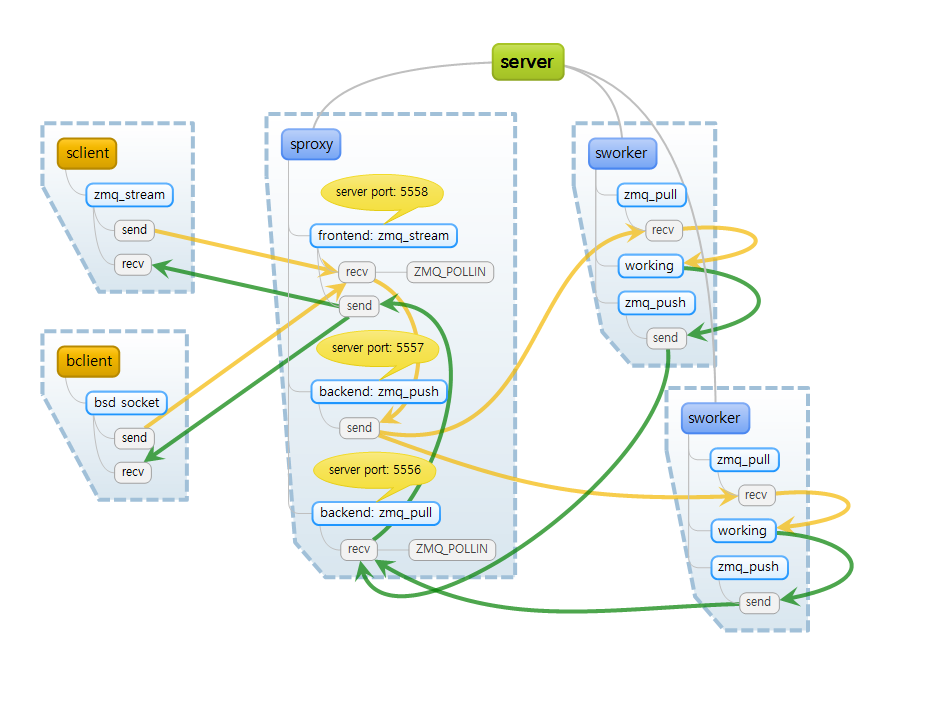

# ZEROMQ 관련 예제
## ZMQ_STREAM 응용

### 목적
* BSD Socket과 ZMQ(ZMQ_STREAM)와 연동 가능 여부 테스트

### 구성도

### 파일 설명
* sserver.cpp: ZMQ_STREAM SERVER
* sclient.cpp: ZMQ_STREAM CLIENT
* sproxy.cpp: ZMQ_STREAM PROXY
  * STREAM->PUSH->PULL->STREAM
* sworker.cpp: ZMQ_STREAM WORKER
* bclient.cpp: BSD SOCKET CLIENT
  * BSD Client Socket

### How To Build
* cmake 사용
* centos에서 빌드, 다른 OS 빌드 테스트 안함.
 
### 특징
* ZMQ_STREAM의 경우 BSD 소켓의 특징과 비슷함.
* 특징 중 하나는 BSD SOCKET 클라이언트에서 10MB의 데이터를 보내면 ZMQ_STREAM 서버에서는 8KB 단위로 끊어져서 수신됨.

